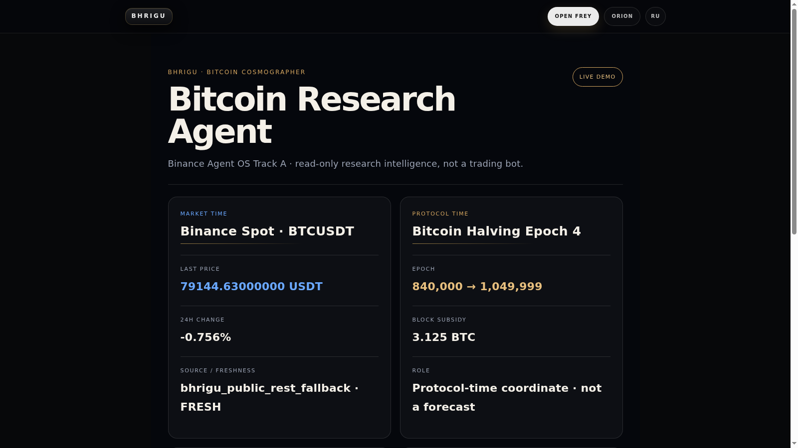

# Binance Agent OS Track A · BHRIGU Submission Packet v0.1

STATUS: DEMO_PACKET / NOT_SUBMITTED
TRACK: A · Build an Agent
PROJECT: BHRIGU Bitcoin Research Agent
BOUNDARY: READ-ONLY RESEARCH / NO TRADING / NO WALLET

## One-line thesis

BHRIGU gives a Bitcoin agent two clocks — Binance market time and Bitcoin protocol time — then binds them to a precommitted observation window, source freshness, confirmation/invalidation, and append-only research memory.

## What the judge should understand in 15 seconds

1. Live Binance BTCUSDT evidence is visible and source-labeled.
2. Bitcoin protocol time is kept separate from market price.
3. The Sep 10 window was precommitted before the event.
4. After the boundary, reality is compared with the preserved record.
5. The agent has zero trading, wallet, withdrawal, transfer, or private-account authority.

## Differentiator

Most crypto agents optimize `market → signal → execution`.
BHRIGU demonstrates `field → window → reality → memory`.
This is a research-intelligence agent, not another trading bot.

## 60-second demo narrative

**0–10s — Problem**
Crypto agents usually collapse Bitcoin into price and execution. BHRIGU keeps market time and protocol time separate.

**10–25s — Live field**
Show Binance Spot BTCUSDT, 24h change, exact source path, observation time, and freshness state.

**25–38s — Second clock**
Show Bitcoin halving epoch 4 and 3.125 BTC subsidy. State explicitly: protocol-time coordinate, not a price forecast.

**38–50s — Prospective memory**
Show `SEP 10 · 2026`: a precommitted observation boundary with no price target and retroactive rewrite forbidden.

**50–60s — Boundary**
End on `FIELD → WINDOW → REALITY → MEMORY` and `RESEARCH_STATE_NOT_TRADE`: trading false, wallet false, private account data false.

## X reply / quote draft

Built **BHRIGU Bitcoin Research Agent** for Binance Agent OS Track A.

It combines live Binance market time with Bitcoin protocol time, a precommitted Sep 10 observation window, explicit confirmation/invalidation, source freshness, and append-only research memory.

No trading authority. No wallet access. No private account data.

`FIELD → WINDOW → REALITY → MEMORY`

Demo video: upload `docs/assets/binance-agent-os-track-a-demo.webm`
GitHub: https://github.com/AiBhrigu/bhrigu-portal/tree/agent/binance-agent-os-track-a-bhrigu-research-adapter-v0-1

## Survey-ready factual fields

- Project name: `BHRIGU Bitcoin Research Agent`
- Track: `Track A · Build an Agent`
- Category: `Bitcoin research intelligence / read-only agent`
- Existing product reused: `BHRIGU BTC Cosmographer`
- Binance surface: `public Binance Spot BTCUSDT market data / Binance CLI-compatible read-only path`
- Trading performed: `No`
- Funds or wallet required: `No`
- Private Binance account data: `No`
- GitHub branch: `agent/binance-agent-os-track-a-bhrigu-research-adapter-v0-1`
- Demo route: `/hackathon/binance-agent-os-track-a`
- Test command: `npm run verify:btc-binance-agent-os-track-a`
- Demo command: `npm run demo:btc-binance-agent-os-track-a`

## Public proof package

- `pages/hackathon/binance-agent-os-track-a.tsx` — judge-facing live demo surface.
- `lib/btc-binance-agent-os-track-a.ts` — bounded read-only adapter.
- `tests/btc-binance-agent-os-track-a-acceptance.ts` — zero-financial-authority acceptance.
- `scripts/btc-binance-agent-os-track-a-demo.ts` — reproducible CLI demo.
- `docs/assets/binance-agent-os-track-a-demo.png` — full captured live demo screenshot.
- `docs/assets/binance-agent-os-track-a-hero.png` — 16:9 submission cover.
- `docs/assets/binance-agent-os-track-a-demo.webm` — 19.4s live browser capture, 1600×900.

## IP boundary · hard invariant

`EXPOSE MEANING / PROTECT MECHANISM`

Public packet may expose interface contracts, public evidence provenance, research semantics, acceptance outcomes, and demo output only.

Protected and excluded from the hackathon packet:

- ORION internal architecture and protected core implementation;
- private prompts, planners, evaluator contracts, or hidden routing laws;
- private corpora, unpublished research reconstruction logic, or training material;
- credentials, API keys, claim codes, account state, or identity secrets;
- wallet, payment, withdrawal, transfer, custody, or entitlement mechanics;
- any mechanism not required to reproduce the bounded public demo.

## Submission gate

Before any X post or survey submission verify:

1. Screenshot/video contains no protected data or local filesystem paths.
2. GitHub target is the exact bounded branch/head, not an unrelated working tree.
3. Demo still reports `trading=false`, `wallet=false`, `private_account_data=false`.
4. Public copy makes no price target, trading signal, guaranteed outcome, or Binance affiliation claim.
5. Account-specific Binance eligibility is checked separately before final submission.

PUBLICATION: FORBIDDEN UNTIL SEPARATE OPERATOR AUTHORITY.
